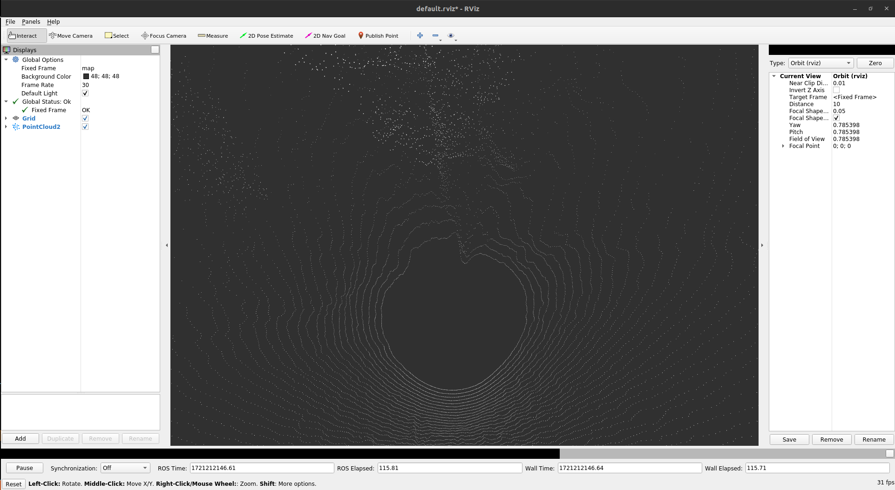
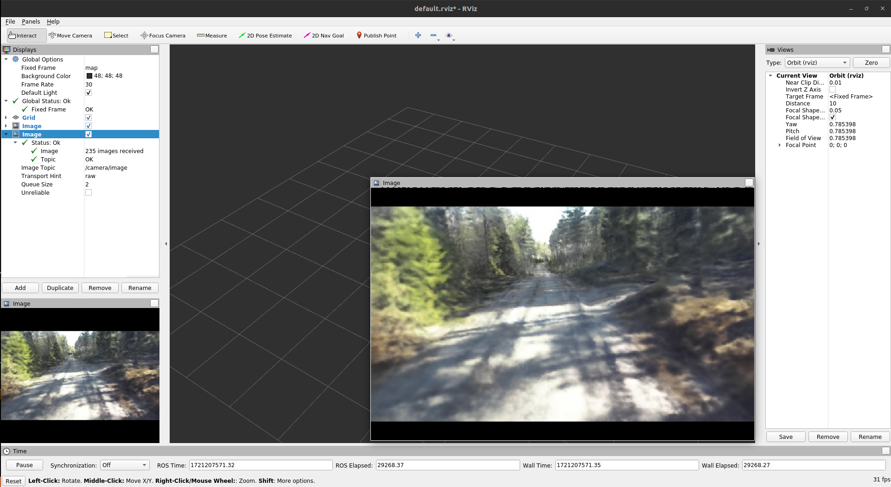
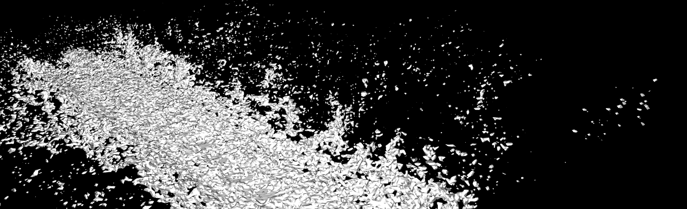

# Ros Integration

This document provides a step-by-step guide on how to launch Rosnodes that output synthetic sensor data. This implementation is a feasability study that shows how the implicit map can be integrated into ROS.

## Build and Source the Catkin Workspace

Source ROS distribution

      source /opt/ros/noetic/setup.bash

(change this to your specific ROS distribution if necessary)

navigate to the source foulder of the catkin workspace (fdt_simulation) and call:

      catkin_make

and

      source devel/setup.bash

launch a roscore

      roscore

Per default an implicit map is loaded from the example_implicit_map folder. In order to switch the map, replace the map in the folder or adjust the example_path in the rosnode file.

## Run synthetic Lidar Node

in order to render synthetic Lidar 

      rosrun synthetic_data traj_pub_node.py
      rosrun synthetic_data synthetic_lidar_node.py

## Run synthetic Camera Node

      rosrun synthetic_data traj_pub_node_camera.py
      rosrun synthetic_data synthetic_camera_node copy.py

## Next Possible Steps 

A few more things need to be added to be able to use these nodes in a closed loop simulations

      - A robot model that publishes transform messages and subscirbes to synthetic sensor messages
      - The desired input and output topics for the robot model for the lidar messages, camera messages, transform messages and static transform messages
      - A collision model of the map

For the collision model, the output of the mesher can be considered, in order to facilitate this we prepared the possibility to generate a ground mesh. In order to do this,
go to analysis/mesher.get_mesh and change:

      scan = build_lidar_scan(lidar_intrinsics) to 
      scan = meshing_ground()

and the call 

      /analysis/meshing.py
with args: 
      "/outputs/02_02_04_yourfolder/",  
      "/cfg/haveri_hpk/02_02_04_yourconfig.yaml", 
      
and optinally add

      "--ckpt_id", "final", 
      "--resolution", "0.15",  
      "--level", "0.1", 
      "--save", 
      "--skip_step", "15"

